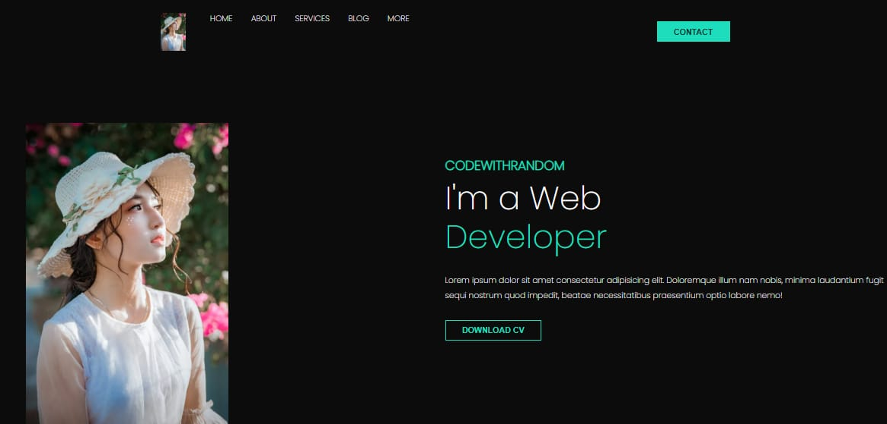
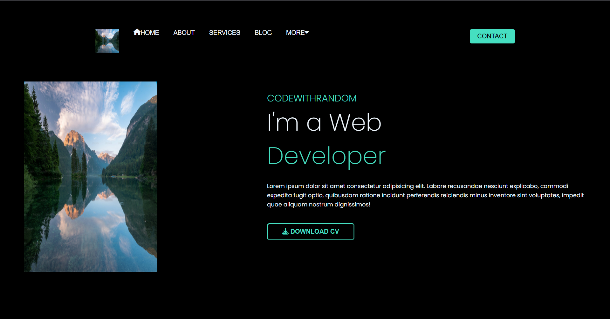

# Web Developer Portfolio Page

## 📸 Project Description

This project is a simple **Web Developer Portfolio** landing page designed to resemble the reference image provided (see below). The page showcases a clean and modern UI with a dark theme, a profile image, a navigation menu, and a highlighted section introducing the developer.

## ✅ Features

- Responsive layout
- Dark theme UI
- Developer intro section
- Navigation bar (Home, About, Services, Blog, More, Contact)
- "Download CV" button

## 🛠️ Technologies Used

- HTML
- CSS

## 💻 OUTPUT

